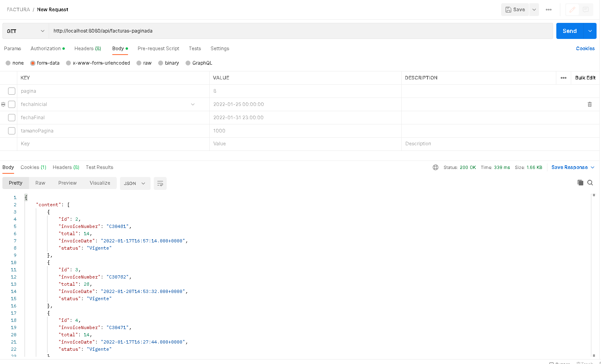
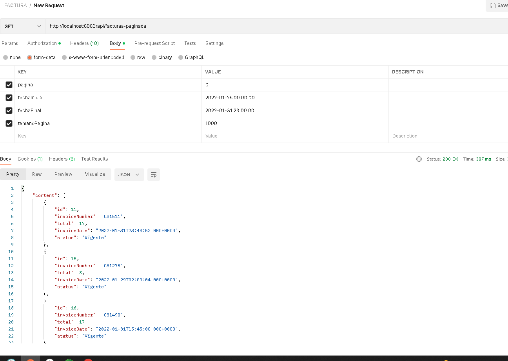

# Factura - Descripción del Proyecto

Este proyecto es una aplicación Spring Boot diseñada para gestionar facturas.

## Tecnologías Utilizadas

- **Java 8:** Lenguaje de programación principal.
- **Spring Boot:** Framework para crear aplicaciones web y RESTful.
- **PostgreSQL:** Base de datos relacional para almacenar la información de las facturas.
- **Lombok:** Biblioteca para reducir el código repetitivo en Java.
- **Spring Data JPA:** Módulo de Spring para facilitar el acceso a datos con JPA.
- **Spring Security:** Módulo de Spring para la seguridad de la aplicación.

## Requisitos Previos

Para ejecutar la aplicación, se requiere tener instalado:

- **Java Development Kit (JDK) 8 o superior:** [Descargar JDK](https://www.oracle.com/java/technologies/downloads/)
- **Apache Maven:** [Descargar Maven](https://maven.apache.org/)
- **PostgreSQL:** [Descargar PostgreSQL](https://www.postgresql.org/)

La instalación de Lombok en Eclipse o Spring Tool Suite (STS) es un proceso sencillo. Sigue estos pasos para instalar Lombok en tu entorno de desarrollo:

## Instalación de Lombok en Eclipse o Spring Tool Suite (STS)

1. **Descargar el Jar de Lombok:**
   - Visita el sitio web de Lombok: [Project Lombok](https://projectlombok.org/).
   - En la página principal, encontrarás un enlace para descargar el JAR de Lombok. Asegúrate de obtener la versión más reciente.

2. **Ejecutar el Jar de Lombok:**
   - Después de descargar el JAR, ejecútalo haciendo doble clic. Esto abrirá una ventana que te guiará a través del proceso de instalación.

3. **Especificar la Ruta del IDE:**
   - Durante la instalación, se te pedirá que especifiques la ubicación de tu instalación de Eclipse o STS. Asegúrate de seleccionar la carpeta correcta.

4. **Instalación Completa:**
   - Completa el proceso de instalación. Lombok debería integrarse automáticamente con tu IDE.

5. **Reiniciar el IDE:**
   - Después de la instalación, reinicia Eclipse o STS para aplicar los cambios.

6. **Verificar la Instalación:**
   - Para asegurarte de que Lombok se haya instalado correctamente, abre o crea un proyecto Java en tu IDE. Agrega una clase con algunos campos y métodos. Deberías ver que Lombok elimina automáticamente la necesidad de escribir getters, setters, constructores, etc.

Con estos pasos, deberías tener Lombok instalado y funcionando en tu entorno de desarrollo Eclipse o STS. Recuerda que algunos entornos pueden requerir ajustes adicionales según su configuración específica. Si encuentras algún problema, verifica la documentación oficial de Lombok o busca soluciones específicas para tu entorno de desarrollo.

## Configuración de la Base de Datos

En este caso ya la base de dato esta alojada en un servidor y no se debe hacer ninguna intalacion o configuracion especial.

## Ejecución de la Aplicación

Para ejecutar la aplicación, sigue estos pasos:

1. Abre una terminal en la raíz del proyecto.
ó
2. Abre el proyecto en tu entorno de desarrollo preferido, como Spring Tool Suite o Eclipse.
3. Instala las dependencias de Maven. Puedes hacerlo desde las opciones del IDE o ejecutando el siguiente comando en la terminal:

   ```bash
   mvn clean install
   ```

4. Ejecuta el proyecto. Puedes hacerlo desde las opciones del IDE o ejecutando el siguiente comando:

   ```bash
   mvn spring-boot:run
   ```

Estos pasos garantizan que el proyecto esté configurado correctamente, las dependencias estén instaladas y la aplicación se ejecute de manera óptima.


La aplicación se iniciará en el puerto 8080 por defecto. Puede acceder a ella en la siguiente URL: [http://localhost:8080/](http://localhost:8080/)

## Proyecto Ejecutado 

### Evidencias
#### Sin parametros

#### con parametros
